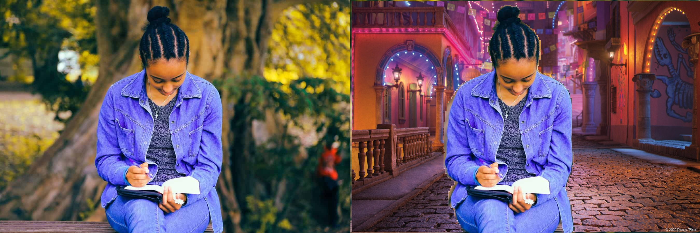

# Background Removal
[U-Net](https://arxiv.org/abs/1505.04597v1) Like([VGG](https://paperswithcode.com/method/vgg) Encoder) Pretrained Model For Human Body Detection ([pytorch](https://pytorch.org/), [Semantic Segmentation](https://paperswithcode.com/task/semantic-segmentation))

#### **Quick Links**
- [Dependencies](#Dependencies)
- [Implementation](#Implementation)
- [Usage](#Usage)
- [Examples](#Examples)

## Dependencies
- Install Dependencies `$ pip install -r requirements.txt`
- Download model weights [Here](https://drive.google.com/drive/folders/1Xqn1tGY0DCj_kL-y1_E2HhoaSJ1JM0uq?usp=sharing), place it in `model_weights/`

## Implementation
### VGG Encoder Implementation
```python
  def VGGEncoder():
    weights = VGG16_Weights.DEFAULT
    base_model = vgg16(weights=weights)
    base_model.training = False
        
    encoder_seq =  nn.ModuleList()
    moduls = nn.Sequential()
    for layer in list(base_model.features.children()):
        if isinstance(layer, nn.modules.pooling.MaxPool2d):
            encoder_seq.append(moduls)
            moduls = nn.Sequential()
        else:
            moduls.append(layer)
    return encoder_seq
```

## Usage:
```python
  detector = BodyDetector("model_weights/bgrm-bh.pth")
```
Load model.

```python
  fname = RandomSample("background folder", '*')
  bg = LoadImage(fname)
```
Read background image.

```python
  fname = RandomSample("image folder")
  img = LoadImage(fname)
  img_resize = cv2.resize(img, (224, 224), interpolation = cv2.INTER_AREA)
```
Read image in bgr mode and resize it to 224*224.

```python
  mask = detector.DetectBody(img_resize)
```
Detect object(human body) area.

```python
  res = ReplaceBG(img, mask, bg)
```
Replace current background with loaded background image.

## Examples





### 🛡️ License <a name="license"></a>
Project is distributed under [MIT License](https://github.com/Saeed-Biabani/Background-Removal/blob/main/LICENSE)
